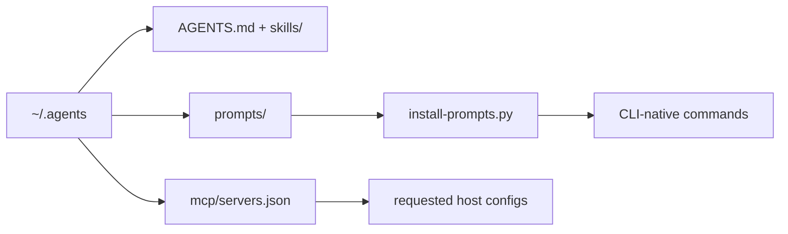

<div align="center">

# universal-template

**One global baseline for AI coding agent CLIs**

Clone once to `~/.agents` to share engineering policy, skills, prompts,
templates, references, and deterministic checks across supported hosts.

[](https://github.com/ryan-brosas/universal-template/actions/workflows/pr-quality.yml) [](https://github.com/ryan-brosas/universal-template/releases/latest)

</div>

## Run

```sh
python3 scripts/install-prompts.py
```

This reconciles the canonical prompts in `prompts/` with each detected CLI's
native command surface. Existing unmanaged files are preserved, and generated
adapters are used only where a host cannot consume Markdown directly.

No lifecycle machinery is required for ordinary work. Project source and local
instructions remain authoritative over this global baseline.

## Why universal-template?

| | Capability | What it unlocks |
| :-: | --- | --- |
| 1 | **One canonical baseline** | Keep global instructions, prompts, templates, and MCP declarations consistent across CLIs. |
| 2 | **Reusable engineering knowledge** | Retrieve focused skills, project references, and accumulated implementation foundations when they add value. |
| 3 | **Mechanical quality gates** | Validate the catalog, policy, prose, prompts, references, and releases before publishing changes. |

## How it fits



`AGENTS.md` owns the user-wide engineering constitution. The catalog and
references provide need-driven capabilities, while scripts derive host formats
and enforce repository contracts. Project-local policy always wins.

## Context model

```text
source/tests/runtime = current software truth
session events       = historical work evidence
recall/reflection    = disposable projections
code/gates/skills    = reviewed durable promotions
```

Nothing loads or searches session history by default. Projections are
disposable; only reviewed code, gates, skills, and rare minimal project notes
persist.

## Install

### Run from source

For a fresh setup:

```sh
git clone https://github.com/ryan-brosas/universal-template.git ~/.agents
cd ~/.agents
python3 scripts/install-prompts.py
```

Point each host's instruction and skill mounts at `AGENTS.md` and `skills/`.
Prompt mounts are managed by the installer. MCP servers are added one at a time
from `mcp/servers.json`; see `mcp/catalog.md` for verified host shapes and secret
handling.

## Usage

Audit installed prompt mounts without changing them:

```sh
python3 scripts/install-prompts.py --check
```

Search the active skill catalog:

```sh
python3 scripts/skill-catalog.py search "github release"
```

Reusable prompts include `/repo-audit`, `/plan-work`, `/implement-work`,
`/review-work`, `/verify-work`, `/cleanup-code`, `/learn`, `/recall-session`,
`/reflect-session`, and `/compile-skill`. `/inspo` qualifies external prior
art; `/learn` investigates one approved source; `/recall-session` answers one
historical question from project-scoped session evidence; `/reflect-session`
derives temporary evidence-linked lessons; `/compile-skill` compiles a proven
procedure into a hidden skill candidate on explicit request. Host invocation
syntax can differ; `scripts/render-prompt.py` provides the fallback for hosts
without a native prompt directory.

Repository maintainers should run the verification suite in `CONTRIBUTING.md`.
Versioned releases use `vX.Y.Z` tags and GitHub-generated notes categorized by
`.github/release.yml`.

## Documentation

- Engineering constitution: `AGENTS.md`
- Contribution and verification contract: `CONTRIBUTING.md`
- Generated skill catalog: `docs/skill-catalog.md`
- Current objectives: `docs/roadmap.md`
- MCP registry and host wiring: `mcp/catalog.md`
- Security policy: `SECURITY.md`

> [!WARNING]
>
> This repository is active global configuration. Changes to linked instructions,
> skills, or prompts can affect every configured host immediately.
